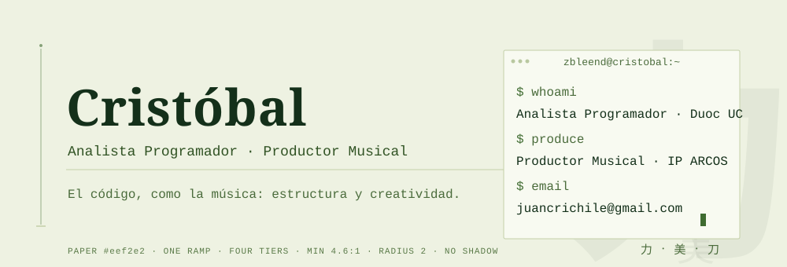
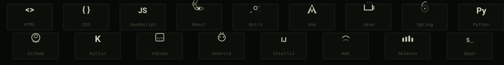

  

  <a href="https://www.linkedin.com/in/cristobal-a-abrigo/"><b>LinkedIn</b></a> · <a href="mailto:juancrichile@gmail.com"><b>Gmail</b></a>

## 力 · Sobre mí

Analista Programador en Duoc UC. Productor Musical en IP ARCOS.

El código, como la música: estructura y creatividad.

- frontend, backend y bases de datos
- código limpio

## 美 · Stack

  

## 刀 · Proyectos

- **[Tamagotchi](https://github.com/zBleend/Prueba-de-Tamagotchi-en-Java)** — Simulación de mascota virtual aplicando POO. `Java`
- **[Banco Virtual](https://github.com/zBleend/Banco-en-Python)** — Lógica de cuentas bancarias y transacciones. `Python`
- **[Conexión JDBC](https://github.com/zBleend/Probando-JDBC)** — Conexión a base de datos MySQL. `Java` `MySQL`
- **[Reloj Digital](https://github.com/zBleend/RelojDigital)** — Reloj digital en HTML, CSS y JavaScript. `HTML` `CSS` `JavaScript`
- **[Calculadora Java Swing](https://github.com/zBleend/Calculadora-Java-Swing)** — Interfaz gráfica interactiva para operaciones matemáticas. `Java` `Swing`
- **[App Mantenimiento](https://github.com/zBleend/AppMantenimientoRust)** — Sistema de mantenimiento para Windows 11. `Rust`

---

  <b>力 · 美 · 刀</b> — por la fuerza, la belleza y el filo

  2026 · Cristóbal

