  

  
  

 

## 作品 Proyectos

<table align="center" width="100%" style="border: none;">
<tr>
  <td width="50%" align="center" style="padding: 15px; background-color: #0a0a0a; border: 1px solid #1a1a1a; border-radius: 4px;">
    <h3 style="color: #e8d5b7; margin-bottom: 8px;">Tamagotchi</h3>
    
Simulación de mascota virtual aplicando POO

    

      
    

    

      <a href="https://github.com/zBleend/Prueba-de-Tamagotchi-en-Java" target="_blank" style="color: #c9a87c; text-decoration: none; font-size: 12px;">→ Ver Código</a>
    

  </td>
  <td width="50%" align="center" style="padding: 15px; background-color: #0a0a0a; border: 1px solid #1a1a1a; border-radius: 4px;">
    <h3 style="color: #e8d5b7; margin-bottom: 8px;">Banco Virtual</h3>
    
Lógica de cuentas bancarias y transacciones

    

      
    

    

      <a href="https://github.com/zBleend/Banco-en-Python" target="_blank" style="color: #c9a87c; text-decoration: none; font-size: 12px;">→ Ver Código</a>
    

  </td>
</tr>

<tr>
  <td width="50%" align="center" style="padding: 15px; background-color: #0a0a0a; border: 1px solid #1a1a1a; border-radius: 4px;">
    <h3 style="color: #e8d5b7; margin-bottom: 8px;">Conexión JDBC</h3>
    
Implementación de conexión a base de datos MySQL

    

      
      
    

    

      <a href="https://github.com/zBleend/Probando-JDBC" target="_blank" style="color: #c9a87c; text-decoration: none; font-size: 12px;">→ Ver Código</a>
    

  </td>
  <td width="50%" align="center" style="padding: 15px; background-color: #0a0a0a; border: 1px solid #1a1a1a; border-radius: 4px;">
    <h3 style="color: #e8d5b7; margin-bottom: 8px;">Reloj Digital</h3>
    
Reloj digital creado en HTML, CSS y JavaScript

    

      
      
      
    

    

      <a href="https://github.com/zBleend/RelojDigital" target="_blank" style="color: #c9a87c; text-decoration: none; font-size: 12px;">→ Ver Código</a>
    

  </td>
</tr>

<tr>
  <td width="50%" align="center" style="padding: 15px; background-color: #0a0a0a; border: 1px solid #1a1a1a; border-radius: 4px;">
    <h3 style="color: #e8d5b7; margin-bottom: 8px;">Calculadora Java Swing</h3>
    
Interfaz gráfica interactiva para operaciones matemáticas

    

      
      
    

    

      <a href="https://github.com/zBleend/Calculadora-Java-Swing" target="_blank" style="color: #c9a87c; text-decoration: none; font-size: 12px;">→ Ver Código</a>
    

  </td>
  <td width="50%" align="center" style="padding: 15px; background-color: #0a0a0a; border: 1px solid #1a1a1a; border-radius: 4px;">
    <h3 style="color: #e8d5b7; margin-bottom: 8px;">App Mantenimiento</h3>
    
Sistema de mantenimiento para Windows 11

    

      
    

    

      <a href="https://github.com/zBleend/AppMantenimientoRust" target="_blank" style="color: #c9a87c; text-decoration: none; font-size: 12px;">→ Ver Código</a>
    

  </td>
</tr>
</table>

 

<!-- Separador 刀 -->

<code>══════════════════════════════════════════════════════════════════════</code>

 

<!-- Footer -->

  力 · 美 · 刀

  2026 · Cristóbal

